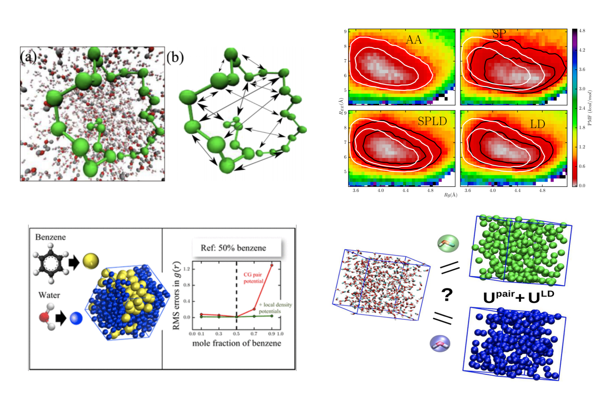

## Coarse-grained backbone forcefields for molecular dynamics simulations of protein folding
<figure style="width: 30%" class="align-left">
  
</figure>
   

## Local density potentials for coarse grained molecular dynamics simulations of liquid mixtures

Developed computationally efficient manybody potentials for improving solvent models in implicit solvent simulations of polymer collapse and liquid-liquid phase separation in coarse-grained binary solutions of small hydrophobes (such as benzene or methanol in water). Depending only on the mean-field local density around solute particles, such potentials signficantly improved predictions of pair structure and clustering behavior of either component across widely varying mixture compositions. This work constitutes some of the very few structurally accurate molecular models of liquid-liquid phase separation in the chemical engineering literature