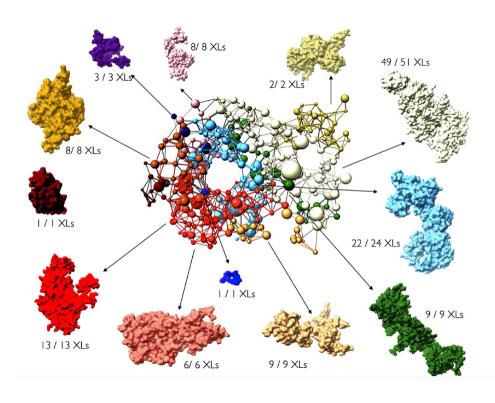
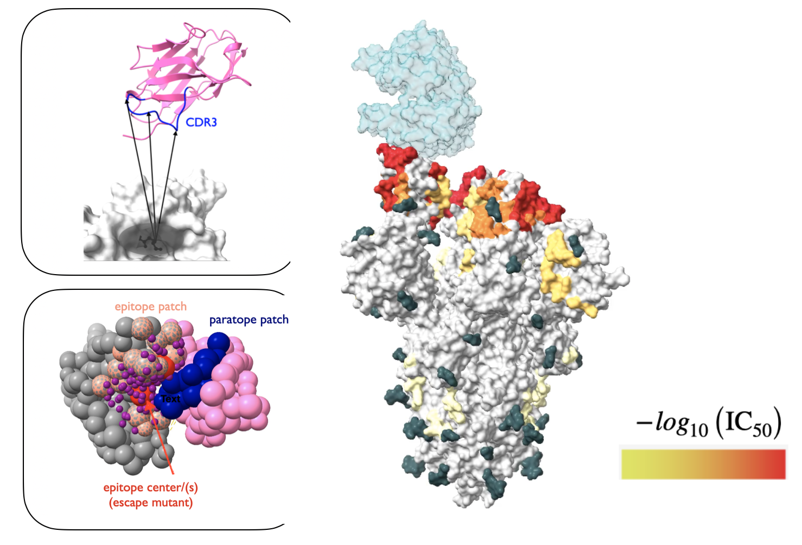
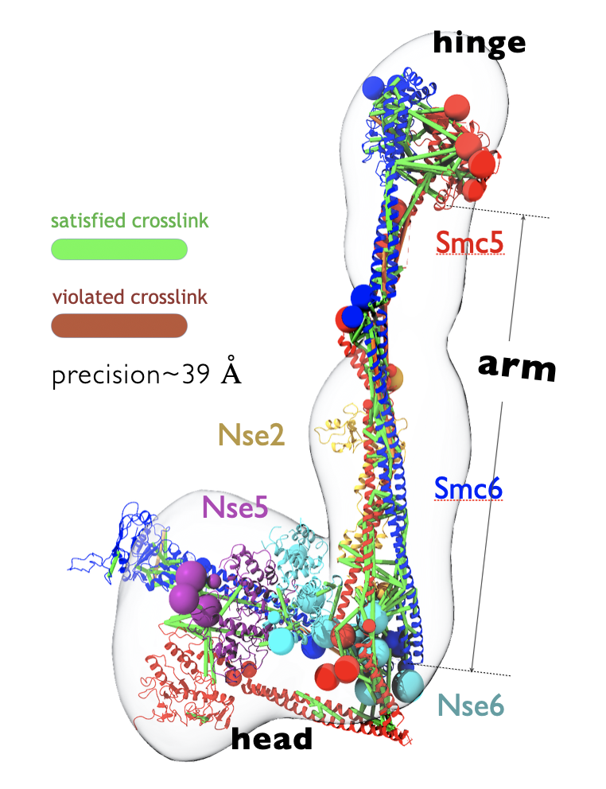
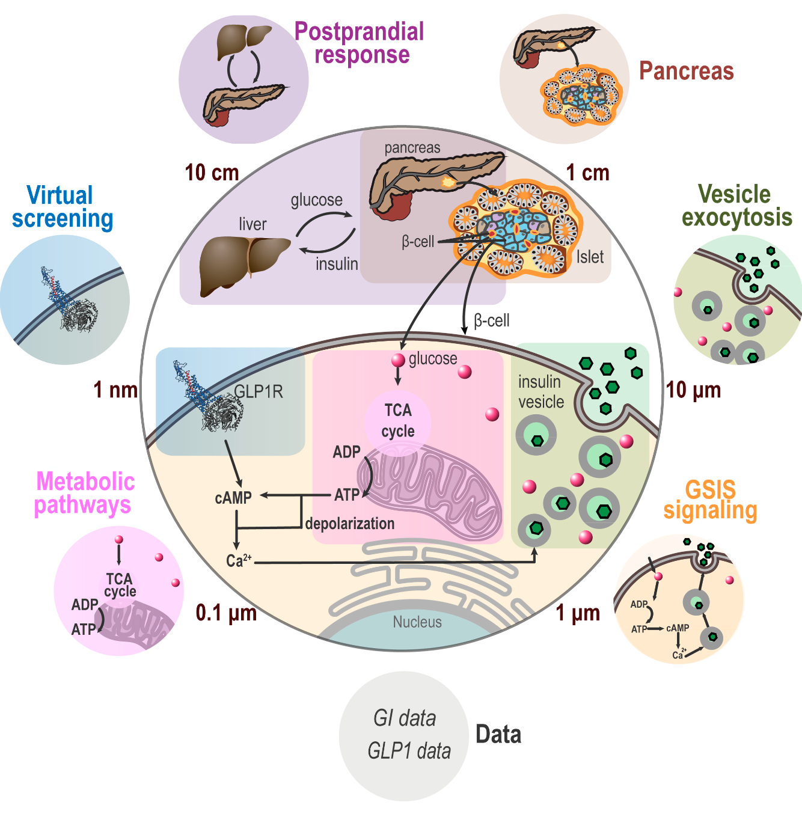
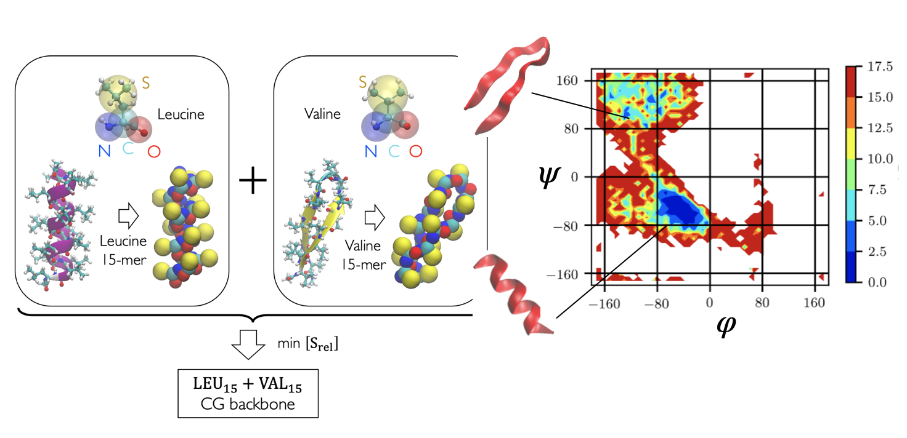
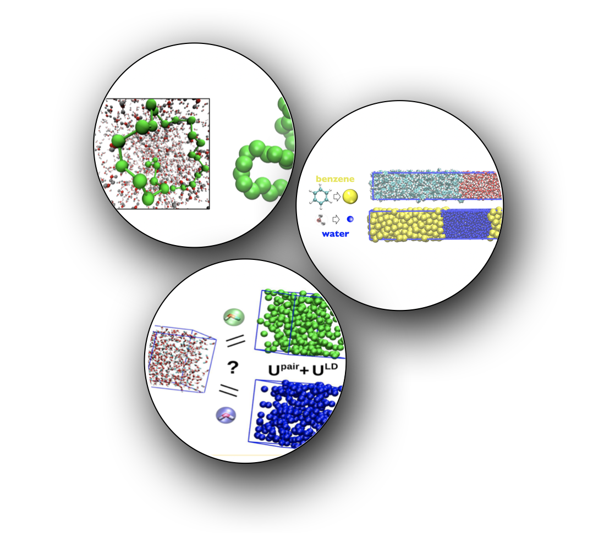

## Non-canonical amino acid modifications to peptides for half-life protraction
While fatty acid and related biopolymers have been conjugated with peptides and other biologics for half-life extension through albumin binding for almost a decade now, there are surprisingly no systematic methods or even best practices in designing the chemistry or the acylation location of such biopolymers on drug moleciules. 

As a protein design scientist within Digital Sciences and Innovation (DSI) at Novo Nordisk Research Center Seattle, I developed a high throughput computational workflow for screening biopolymers and optimizing their attachment location on peptide scaffolds that minimize undesirable interactions with the peptide or the target receptor. The problem maps directly into the more well-known problem of modifying one or more locations on peptide scaffolds into rather special non-canonical amino acids that possess long chain fatty acid sidechain groups. Thus our approach is generally applicable to designing any non-canonical modifications to biologics beyond peptides.

 

 

## Data-driven representation of protein complexes for integrative modeling

Despite recent rapid developments in protein sequence representations from language models, and some results in protein structure representation (albeit with limited success), general ideas of structure representation remain unexplored for integrative models that combine component sub-structures, in-silico structures and experimental data. 

In this (onging) investigation, we explore the connections between one aspect of protein complex structure in integrative models, namely rigid (multi-chain) domains, and experimental crosslink data. While there exist some sparse guidelines in the literature for optimizing the resolution of flexible regions used to represent missing residues within and between the rigid components in an integrative model, the process of defining rigid regions is entirely ad-hoc, often leading to several tedious rounds of trial and error between the computational modeler and their experimental collaborator(s).

Taking inspiration from domain formation in statistical spin-glass models, we are developing an automatic sampling scheme for selecting rigid bodies in integrative models depending only on (noisy) crosslink information, as a general tool for pre-processing available structures to ensure greater consistency with input crosslinks. 

Stay tuned for further details! 

 

 

## Integrative modeling of nanobody epitopes on the SARS-CoV-2 Spike protein

Developed integrative protein-protein docking approaches to characterize the epitopes of nanobodies on the Receptor Binding Domain (RBD) of the SARS-CoV-2 spike protein. This was part of a diverse study of nanobodies as efficacious drug candidates against Covid-19 and was the result of a huge collaboration between labs within the [National Center for Dynamic Interactome Research](https://www.ncdir.org/) (NCDIR). 

Unlike traditional protein-protein docking methods implemented in softwares like PatchDock or Rosetta, this study involved unifying chemical crosslinking and escape mutation data to pinpoint the nanobody binding mode on the RBD. Ultimately, we built integrative rigid-rigid docking restraints within the Sali lab protein modeling software [IMP](https://integrativemodeling.org/), that predicts a coarse-grained nanobody binding mode and epitope shape and reports prediction uncertainties for both.

The structural models were useful in understanding and validating pairwise synergy between nanobodies on the RBD, and resulted in the stratification of a repertoite of 20+ nanobodies into different groups according to their most probable target areas on the RBD surface. 

- Tour de-force [paper](https://elifesciences.org/articles/73027) on the anti-SARS-CoV-2 nanobody repertoire published in eLife!
- Recently submitted a follow-up manuscript where we extend the group classificaiton of RBD epitopes to popular variants of concern: Delta, Omicron BA.1 and BA.4. 

Modeling scripts and the integrative rigid-rigid docking protocol can be found [here](https://github.com/integrativemodeling/smc56_nse256).

 

 

## Integrative modeling of the SMC5/6 protein complex

Developed an integrative structure model of the (yeast) SMC5/6 proteins in complex with the SUMO ligase NSE2, and the associated NSE5/6 proteins. Structural Maintenance of Chromosomes (SMC)s are important chromatin modulators involved in DNA repair and regulation. Despite general topological similarities with other SMC proteins (like condensin and Cohesin), the molecular bases of SMC5/6 remain poorly understood. 

Here, we combined crystal structures of the globular head and hinge regions of SMC5/6, cryo-EM structure of the NSE5/6 sub-complex, in-silico designed coiled-coil structures of SMC5/6 shaft-like "arms", and 337 unique inter-residue chemical crosslinks (generated in this study) to compute the integrative structure of the complex. The model is well validated by negative-stain 2D class averages of SMC5/6 cryo-EM snapshots, as well as high crosslink satisfaction. The most significant insight we obtained from the 3D structure was that the SMC5/6 arms remain relatively straight and not bent, in consistency with the crosslinking dataset. 

- [Published](https://www.pnas.org/doi/abs/10.1073/pnas.2026844118) the structure in PNAS, in collaboration with the [Zhao](https://www.mskcc.org/research/ski/labs/xiaolan-zhao), [Patel](https://www.mskcc.org/research/ski/labs/dinshaw-patel), and [Kentsis](https://www.mskcc.org/research/ski/labs/alex-kentsis) labs at Sloan Kettering.
- Deposited the structure in [PDB-Dev](https://pdb-dev.wwpdb.org/entry.html?PDBDEV_00000081), which is a nascent version of the PDB for in-silico computed structures. 

Modeling scripts (using the [IMP](https://integrativemodeling.org/) software developed in the Sali lab at UCSF) can be found [here](https://github.com/integrativemodeling/smc56_nse256). 

 

 

## Bayesian network approaches for whole cell modeling

Developed directed graphical models for integrating models of the pancreatic beta cell at different length scales and of fundamentally different types under a common statistical framework. Component sub-models included pharmacokinetic models of glucose-insulin dynamics, (simplified) Brownian diffusion models of molecular interaction between glucose and insulin vesicles, and network models (ordinary differential equations) describing simple enzyme kinetics from glucose entry to the cell to Ca2+ mediated insulin vesicle exocytosis.

Built Bayes nets in PyMC3 and designed a lightweight API to automatically combine models of the above type into an overarching whole-cell-model that can query arbitrary variable relationships. For instance, how does insulin vesicle translocation speed through cytoplasm, which is a microscopic property belonging to the molecular sub-model, change in response to glucose level intake which is a macroscopic property, belonging to the pharmacokinetic sub-model? 

While much of this work is at a proof-of-concept level, we envision that this will open new opportunities for de-centralized collaboration between computational labs that practice different types of cell modeling, specializing in different length scales.

We named the approach "Bayesian metamodeling" and published a proof of concept [paper](https://www.pnas.org/doi/10.1073/pnas.2104559118) (as a part of the [Pancreatic Beta Cell Consortium](https://dornsife.usc.edu/bridge-institute/pancreatic-beta-cell-consortium/#:~:text=The%20Pancreatic%20Beta%20Cell%20Consortium,of%20the%20pancreatic%20beta%20cell). 

The software framework developed in this work was presented as a [tutorial](https://github.com/tanmoy7989/bayesian_metamodeling_tutorial) implemented in PyMC3.

 

 

## Coarse grained backbone forcefields for template free protein folding

Developed simplistic coarse-grained models of hydrophilic and hydrophobic poly-amino acids which can be intelligently combined to produce remarkably accurate backbone models for folding short peptide fragments as well as globular protein domains. This work was a proof of principle for protein backbone models designed from amino-acid polymers, and using only native contact based sidechain interactions. Demonstrated the potential to successfully fold 200+ residue proteins. Possible future directions include combining reduced alphabet and full alphabet sidechain interactions with aforementioned backbone forcefields to produce sequence chemistry dependent protein models.

- [Paper](https://aip.scitation.org/doi/10.1063/1.5108761) published in Journal of Chemical Physics (JCP). This was later selected as an editor's pick and made it to the list of 88 most influential articles of 2019 in JCP.
- A bare bones [github repository](https://github.com/tanmoy7989/protein_model) for this project has been set up but not fully documented yet. Note that a substantial part of the code uses the `sim` package written in Python-2.7. A copy of `sim` can be obtained through personal request to [M. Scott Shell](https://chemengr.ucsb.edu/people/m-scott-shell) at University of California Santa Barbara.
Coarse grained backbone forcefield paramters in a LAMMPS format input file can be found [here](../assets/others/go_model_ff.tar).

This work also involved the creation of a [post-processing utility](https://docs.lammps.orgTools.html#replica) that re-orders LAMMPS replica exchange trajectories (generated using `fix/temper`) by temperature.

 

 

## Coarse-grained molecular models of fluid phase equilibria

Developed computationally efficient manybody potentials for improving solvent models in implicit solvent systems using variational inference techniques. Benchmarked the method on folding of alkanes and liquid-liquid phase separation in coarse-grained aueous solutions of small hydrophobes (benzene and methanol). Depending only on the mean-field local density around solute particles, such potentials signficantly improved predictions of pair structure and clustering behavior of either component across widely varying mixture compositions. This work constitutes one of the very few structurally accurate molecular models of liquid-liquid phase separation in the chemical engineering literature.

- Our [first paper](https://aip.scitation.org/doi/abs/10.1063/1.4958629) introduced the mathematical and computational details of the local density potential.
- Our [second paper](https://pubs.acs.org/doi/abs/10.1021/acs.jpcb.7b12446) applied the method to develop thermodynamically robust models of phase behavior in benzene-water mixtures.
- We also co-wrote a [paper](https://pubs.acs.org/doi/abs/10.1021/acs.jctc.8b01170) with [van der Vegt group](https://www.cpc.tu-darmstadt.de/research_cpc/topics_cpc/index.en.jsp) at TU Darmstadt to investigate the applicability of the local density approach to structurally inhomogeneous mixtures of methanol in water.

The local density potential was submitted as a [`pair style`](https://docs.lammps.org/pair_local_density.html) to the molecular simulation software LAMMPS.